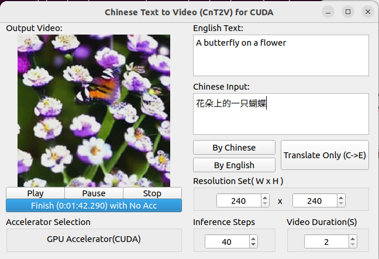
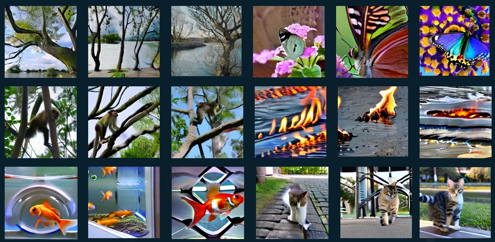

# 基于中文文字生产视频的表情包制作软件(CUDA版本)

## 1,软件界面

## 2,生成的视频

相关提示词：河边的树，花朵上的一只蝴蝶，一只猴子在爬树，水上燃烧的火焰，一只在鱼缸中的金鱼，一只熊猫在岩石上吃竹子

## 3，方案简介

该技术方案采用Qt作为上层GUI，然后使用C/C++和python的混合编程的方式。后端推理采用CUDA框架，占用显存峰值约14GB，我测试的时候使用的是Tesla M40(24GB)的显卡。

## 4，演示视频

https://b23.tv/5nVXUwL

